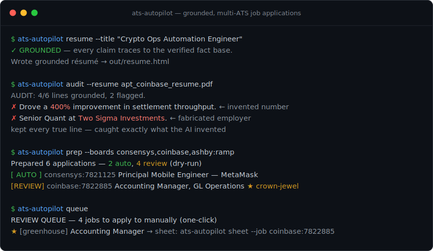

# ats-autopilot

**A schema-driven, multi-ATS job-application engine with human-in-the-loop safety.**



Most job applications don't live on the company's website — they run on a handful of
Applicant Tracking Systems (Greenhouse, Lever, Ashby, …), and those systems expose the
*entire application form as structured data over a public API*. `ats-autopilot` reads that
schema, maps a profile onto it once, and prepares a complete, ready-to-submit application —
no browser automation, no screen-scraping, no CAPTCHA games.

It is deliberately **not** a spray bot. Every irreversible action is gated behind a dry-run
default and an explicit human approval, because submitting an application under your name is
not something a script should do unsupervised.

```
discover ──▶ read schema ──▶ auto-fill ──▶ review ──▶ submit
 (public      (fields,        (profile +    (dry-run   (human-gated;
  ATS API)     types, reqs)    answer rules)  default)   never crowns)
```

## Why it's built this way

| Design choice | Reason |
|---|---|
| **Schema-driven, not scraped** | The ATS hands us field names, types, and required-flags as JSON. Reading the schema means one code path works across every job on a board — no per-posting selectors to break. |
| **Adapter pattern** | Each ATS is a small adapter implementing `list_jobs` / `get_schema` / `submit`. Adding a platform doesn't touch the engine. |
| **Declarative answers** | Screening questions ("authorized to work?", "18+?") are matched to answers by a rules file, so tuning behavior never means editing code. |
| **Dry-run by default & human-in-the-loop** | Submitting is irreversible and done under a real identity. The engine *prepares* everything and stops; a human approves the send. High-value ("crown-jewel") employers are review-only, always. |
| **Idempotent tracker** | A local SQLite ledger records every application, so the engine never double-applies and you get an audit trail. |

This mirrors the risk-engineering discipline from my trading infrastructure
([HERMES/NIMBUS](https://github.com/ludwigxaver/quant-validation)): fail-closed defaults,
no unsupervised irreversible actions, and an independent record of everything that happened.

## Install

```bash
git clone https://github.com/ludwigxaver/ats-autopilot
cd ats-autopilot
pip install -e .
```

## Usage

```bash
# 1. copy the example profile and fill it in
cp config/profile.example.yaml config/profile.yaml

# 2. discover + prepare applications (DRY-RUN — nothing is submitted)
ats-autopilot prep --boards coinbase,gemini,ripple --limit 10

# 3. review what it prepared
ats-autopilot review

# 4. submit a single, specific application after you've reviewed it
#    (requires --i-have-reviewed; crown-jewel employers are refused here by design)
ats-autopilot submit --job coinbase:8020892 --i-have-reviewed
```

### Using an AI-tailored résumé (e.g. apt.ai) safely

Third-party tools like [apt.ai](https://tryapt.ai) write beautifully tailored résumés — but
they're LLM-generated and can embellish. Instead of trusting them, **gate their output**:

```bash
# audit an apt.ai résumé against your verified facts; flags anything it invented
ats-autopilot audit --resume ~/Downloads/apt_coinbase_resume.pdf

# or emit a grounded copy with fabricated lines removed
ats-autopilot audit --resume apt_resume.txt --clean --out out/coinbase.grounded.txt
```

Every flagged line is either an embellishment to drop, or a *true* fact you should add to
`facts.yaml` — so the audit both catches lies and surfaces gaps in your fact base. You keep
the sophisticated tailoring; the verifier guarantees nothing false ships.

## Architecture

```
ats_autopilot/
  engine.py        # orchestration: discover → schema → fill → bundle → (gated) submit
  profile.py       # typed candidate profile (loaded from YAML)
  answers.py       # declarative screening-question → answer rules engine
  tracker.py       # idempotent SQLite application ledger
  adapters/
    base.py        # ATSAdapter protocol: list_jobs / get_schema / submit
    greenhouse.py  # Greenhouse Job Board API
    lever.py       # Lever Postings API
  cli.py           # command-line interface
```

## Supported platforms

| ATS | Discover | Read schema | Submit | Lane |
|---|:--:|:--:|:--:|:--|
| Greenhouse | ✅ | ✅ | ✅ (public form POST) | auto |
| Lever | ✅ | ✅ | 🔬 experimental | auto |
| Ashby | ✅ | standard form | ❌ no public submit API | **review-queue** |
| Workday | 🔬 best-effort | standard form | ❌ account + wizard | **review-queue** |
| LinkedIn | — | — | — | not supported |

Boards without a public submission path (Ashby, Workday) — and any **crown-jewel** employer —
are never auto-submitted. They route to the **review queue** for a manual one-click:

```bash
ats-autopilot queue                      # the manual-apply to-do list, with apply URLs
ats-autopilot sheet --job ramp:abc-123   # a ready-to-paste application sheet for one job
```

So the engine has two lanes by design: **auto** (public-API ATSs, non-crown) and **review**
(everything irreversible-sensitive), and it never blurs them.

## Safety & scope

- **Dry-run is the default.** `prep` never submits.
- **Submission is per-job and human-approved.** There is no "submit all."
- **Crown-jewel employers are review-only** — the engine refuses to auto-submit to them.
- Does **not** bypass CAPTCHAs, anti-bot challenges, or authentication walls; respects rate limits.
- Intended for **your own** applications. Don't point it at anyone else.

## License

MIT — see [LICENSE](LICENSE).
